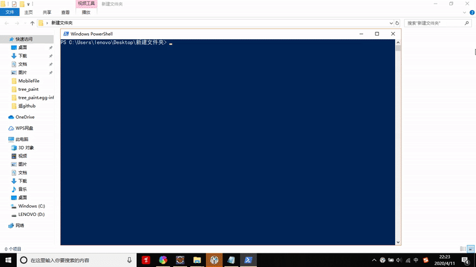

# tree_paint
根据给定的参数，通过迭代和随机，画出一棵树来，可选参数包括迭代次数，树枝长度，颜色等。



我本来想打包成直接可以在命令行运行的，结果弄了半天也弄不好，无奈只能通过

```
python -m tree_paint
```

来运行了。

安装简单，只要解压后在powershell窗口中执行

```
python setup.py install
```

就行了。